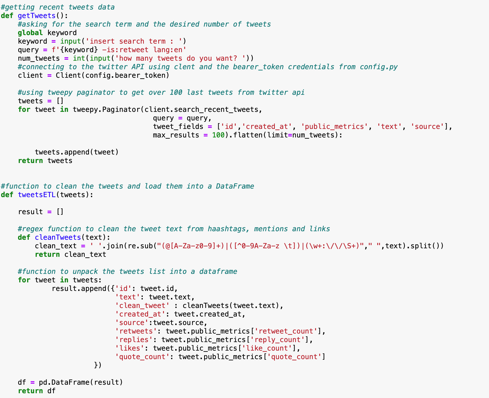
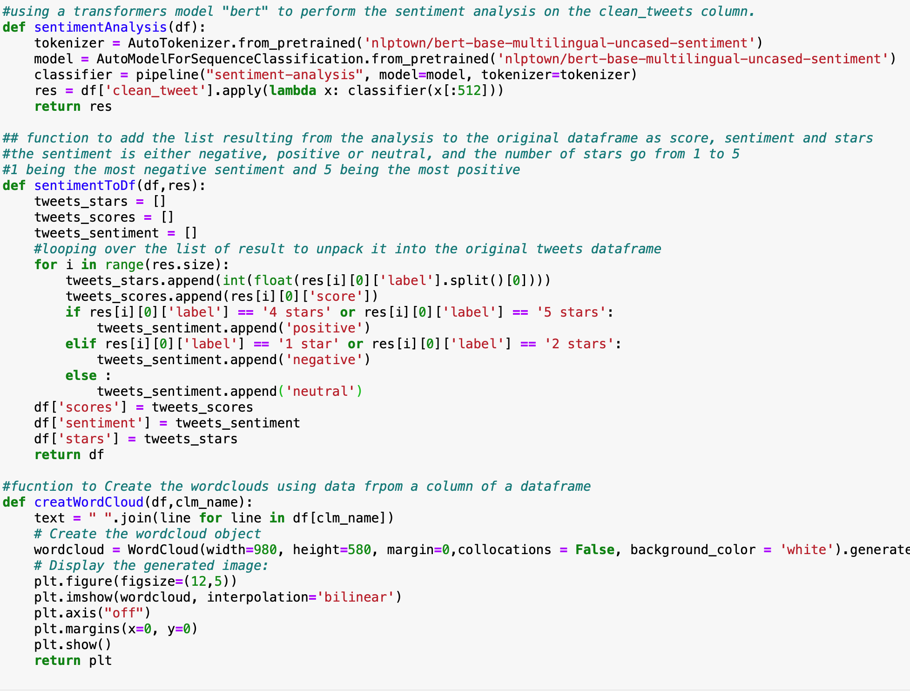
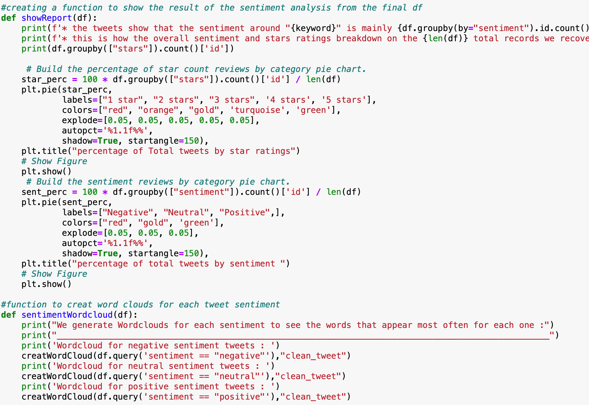
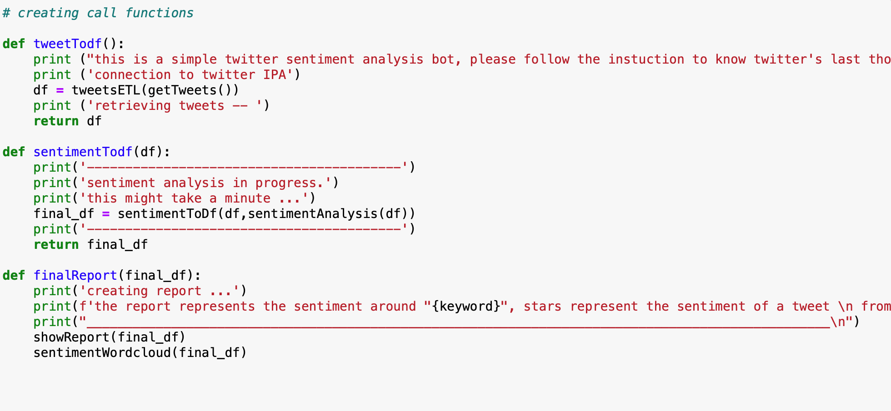

# Twitter sentiment analysis bot

## Project overview
This project uses Twitter API v2  with the Tweepy library to request tweet data based on a search keyword and a desired number of tweets both given by the user. the data is then put through an ETL process, and into Pandas dataframe, and then run through a transofrmer based nlp model for sentiment analysis "BERT". The sentiment result is then added to the tweets and the resulting dataframe is used for analysis to generate a report that details twitter's last sentiment about the given keyword.

#### PS : in order for the code to run you need to provide your own config.py file which is nothing but a simple python file where we're gonna store details about your twitter API access details. also make sure you have the following libraries installed in your working environment.

### Dependencies and Resources

* Python 3.9.0,
* Jupyter notebook 6.0.3,
* Twitter API v2
* Libraries: Tweepy, Pandas, Matplotlib.pyplot, WordCloud, Transofmers, re

## implementation

* We start by creating a config.py and storing our access keys and bearer token in variables that we will have access to after importing config if you don't have twitter API access credentials you can apply for them here : [apply for access](https://developer.twitter.com/en/apply-for-access)
* we import the necessary dependencies.

* next we write a function that uses tweepy Paginator to make a call to twitter API using a number of tweets and a search keyword that are obtained from user input, the result is saved into the tweets list, for more information on how to use Paginator and Tweepy in general please refere to : [Tweepy documentation](https://docs.tweepy.org/en/latest/).

* The next function takes the list from the previous function and turns it into a dataframe, we use a cleaning regex funtion to strip the tweet text from any attached mentions, hashtags or links and store it in a column we name "clean_tweet".

* The next function uses a pretrained transformers NLP sentiment analysis model called "BERT" for more information about Bert please refere to the documentaion here :  [BERT documentation](https://huggingface.co/transformers/model_doc/bert.html)

We creat a tokenizer by loading a pretrained tokenizer from the library by giving its name in the string passed in as a parametre, a list of possible models can be found on the documentaion mentionned above, we create a model the same way, then we use a pipeline where we specify the type as "sentiment-analysis" and the tokenizer and model to be used.\
We run the model on each "clean tweet" text and store the output in a results list.\
the output from this model is a score from 0 to 1  and a 1 to 5 sentiment indicator, 1 being the worst sentiment and 5 being the best.

* Next we create a function that takes the last result list and unpacks it into the dataframe by storing the data in 3 new columns: score for the resulting score, stars which would indicate the result sentiement number and a sentiement column that takes neutral if the number of stars is 3 and negative or positive if the number is lower or higher respectevly, the result is a final dataframa that has the original tweets data in addtion to the sentiment analysis data.

* The next function we create is going to be reponsible for creating every WordCloud, it takes as parameters a dataframe and the column to generate the wordcloud based on, for more information about wordcloud you can refere to the documention here :  [WordCloud doc](https://amueller.github.io/word_cloud/)

* Next we build a function that creates a report using the final tweet dataframe, by grouping the data using the stars rate and the sentiment.\
 first it gives out a general sentiment based on the sentiment most represented in the tweet list then it creates Pie sharts to visually represent the breakdown.

* The next function uses the previous WordCloud function to create a wordcloud using tweets for each of the sentiments 

* we create call functions to streamline the process

### twitter sentiment analysis bot demo

we run the process through the calling functions pipeline :

* We enter a search keyword and a number of tweets:

## Result

#### More examples

